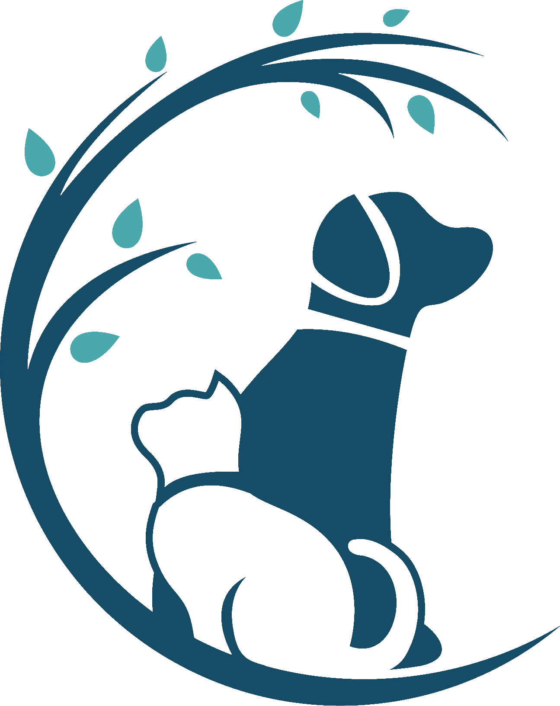
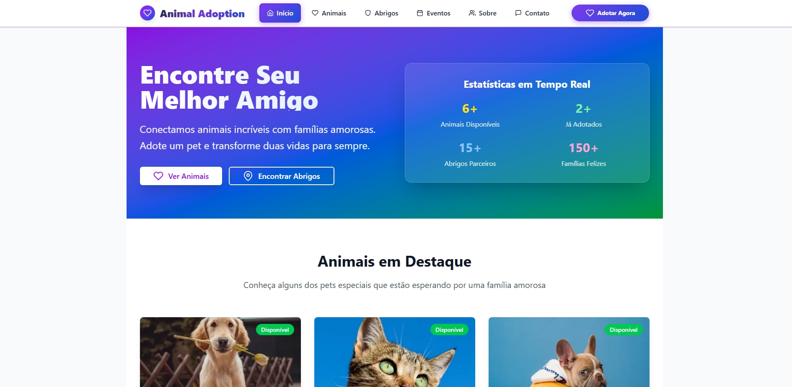
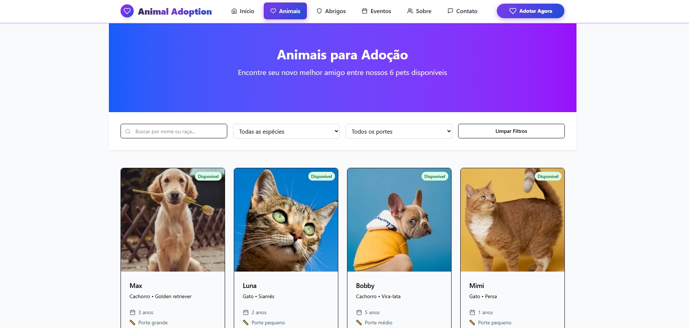
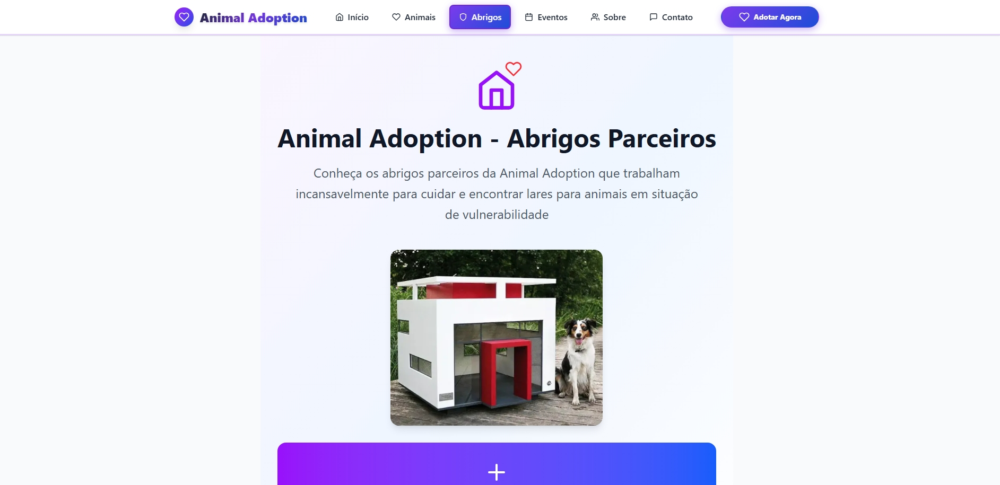
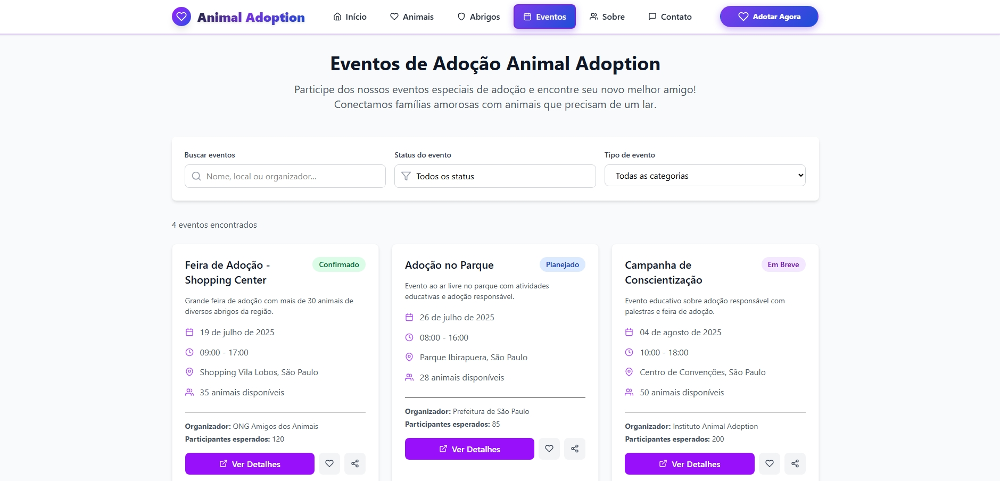
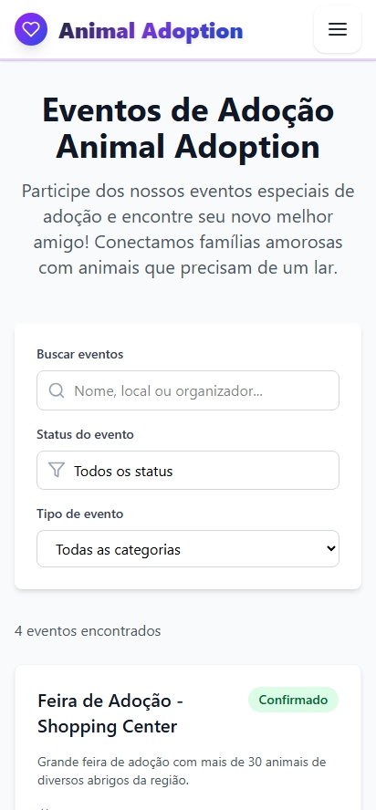

# � Animal Adoption Platform

<div align="center">



**A modern and comprehensive platform for animal adoption, connecting pets with loving families**

[](https://nextjs.org/)
[](https://www.typescriptlang.org/)
[](https://tailwindcss.com/)
[](https://reactjs.org/)

[🚀 Live Demo](https://animal-adoption-alissonn17s-projects.vercel.app/) • [📋 API Documentation](https://github.com/your-squad/animal-adoption-api) • [📱 Screenshots](#-screenshots)

</div>

---

## 📖 Project Overview

Animal Adoption Platform is a modern, full-stack web application developed as part of Module 5 (M5-PDA) of the **Programadores do Amanhã** Full-Stack Web Developer course. This project demonstrates the integration between frontend and backend technologies, consuming an API developed by another squad in Module 4.

Our mission is to **transform lives through responsible adoption**, connecting amazing animals with loving families through an intuitive, modern, and accessible digital platform.

### 🎯 Key Features

- **� Advanced Search & Filtering** - Find the perfect pet with smart filters
- **🏠 Shelter Management** - Comprehensive shelter partner system
- **📅 Events Platform** - Adoption events with interactive calendar
- **💬 Contact Forms** - Direct communication with shelters and organizers
- **📱 Responsive Design** - Seamless experience across all devices
- **🌟 Modern UI/UX** - Clean, intuitive interface with smooth animations
- **♿ Accessibility** - WCAG compliant for inclusive user experience

---

## 🛠️ Technologies & Versions

### Frontend Stack

| Technology | Version | Purpose |
|------------|---------|---------|
| **Next.js** | `15.3.5` | React framework with App Router |
| **React** | `^19.0.0` | UI library for component-based architecture |
| **TypeScript** | `^5.0.0` | Type-safe JavaScript development |
| **TailwindCSS** | `^4.0.0` | Utility-first CSS framework |
| **React Hook Form** | `^7.60.0` | Performant forms with easy validation |
| **Zod** | `^4.0.5` | TypeScript-first schema validation |
| **Axios** | `^1.10.0` | Promise-based HTTP client |
| **React Icons** | `^5.5.0` | Popular icon library for React |

### Development Tools

| Tool | Version | Purpose |
|------|---------|---------|
| **ESLint** | `^9.0.0` | Code linting and quality assurance |
| **Tailwind Merge** | `^3.3.1` | Utility for merging Tailwind classes |
| **@hookform/resolvers** | `^5.1.1` | Validation resolvers for React Hook Form |
| **clsx** | `^2.1.1` | Utility for constructing className strings |

---

## 🚀 Getting Started

### Prerequisites

Before running this project, make sure you have:

- **Node.js** (version 18.0 or higher)
- **npm** or **yarn** package manager
- **Git** for version control

### Installation & Setup

1. **Clone the repository**
   ```bash
   git clone https://github.com/alissonn17/AnimalAdoption.git
   cd AnimalAdoption
   ```

2. **Install dependencies**
   ```bash
   npm install
   # or
   yarn install
   ```

3. **Environment Configuration**
   ```bash
   # Copy environment template
   cp .env.example .env.local
   
   # Edit .env.local with your API configurations
   NEXT_PUBLIC_API_URL=https://your-api-url.com
   ```

4. **Run Development Server**
   ```bash
   npm run dev
   # or
   yarn dev
   ```

5. **Open your browser**
   Navigate to [http://localhost:3000](http://localhost:3000)

### Build for Production

```bash
# Create optimized production build
npm run build

# Start production server
npm start
```

---

## 📁 Project Structure

```
src/
├── app/                     # Next.js App Router
│   ├── components/          # Reusable UI components
│   │   ├── ui/             # Base UI components
│   │   ├── Header.tsx      # Navigation header
│   │   ├── Footer.tsx      # Site footer
│   │   └── ...             # Other components
│   ├── abrigo/             # Shelter management pages
│   ├── animais/            # Animal listing pages
│   ├── eventos/            # Events platform
│   ├── contato/            # Contact forms
│   ├── sobre/              # About page
│   ├── services/           # API integration services
│   ├── types/              # TypeScript type definitions
│   └── lib/                # Utility functions
├── public/                 # Static assets
└── docs/                   # Project documentation
```

---

## 🔗 API Integration

This frontend application consumes the **Animal Adoption API** developed by our partner squad in Module 4.

**API Repository:** [Animal Adoption API](https://github.com/your-squad/animal-adoption-api)

### API Endpoints Used

- `GET /animals` - Fetch available animals for adoption
- `GET /shelters` - Retrieve shelter information
- `GET /events` - Get adoption events
- `POST /contact` - Submit contact forms
- `GET /animals/:id` - Get specific animal details

---

## 📸 Screenshots

### 🏠 Homepage

*Modern landing page with hero section and featured animals*

### 🐕 Animals Page

*Advanced search and filtering for available pets*

### 🏢 Shelters Management

*Comprehensive shelter partner management system*

### 📅 Events Platform

*Interactive events calendar with filtering capabilities*

### 📱 Mobile Responsive

*Fully responsive design for all devices*

---

## 👥 Team & Contributors

**Squad 1 - Module 5 PDA**

| Avatar | Name | Role | GitHub |
|--------|------|------|--------|
|  | **Alisson** | Team Lead & Frontend Developer | [@alissonn17](https://github.com/alissonn17) |
|  | **Deivid Leal** | Frontend Developer & UI/UX | [@DeividLeal](https://github.com/DeividLeal) |
|  | **João** | Frontend Developer | [@hjoao12](https://github.com/hjoao12) |
|  | **João Bel** | Frontend Developer | [@joao17-bel](https://github.com/joao17-bel) |
|  | **Davi Nunes** | Frontend Developer | [@Davinunesaz](https://github.com/Davinunesaz) |
|  | **Caio Sousa** | Frontend Developer | [@caiousousa](https://github.com/caiousousa) |

---

## 🔄 Development Workflow

### Commit Standards

We follow **Semantic Commits** and **Gitmoji** conventions:

```bash
# Examples of our commit structure
feat: ✨ add new animal search functionality
fix: 🐛 resolve responsive layout issues
docs: 📝 update README with API integration guide
style: 💄 improve UI components styling
refactor: ♻️ optimize API service architecture
```

### Git Workflow

1. **Feature branches** for all new development
2. **Pull requests** with code review process
3. **Semantic commits** in English
4. **Automated testing** before merge
5. **Continuous deployment** to Vercel

---

## 🚀 Deployment & Links

### Live Application
- **🌐 Production Site:** [Animal Adoption Platform](https://animal-adoption-alissonn17s-projects.vercel.app/)
- **📱 Mobile Optimized:** Fully responsive across all devices
- **⚡ Performance:** Optimized with Next.js and Vercel Edge Network

### Social Media & Presentation
- **📺 LinkedIn Presentation:** [Project Showcase](https://linkedin.com/posts/your-presentation)
- **📋 Project Documentation:** [GitHub Wiki](https://github.com/alissonn17/AnimalAdoption/wiki)

---

## 🌟 Key Achievements

- ✅ **5+ Semantic Commits** with comprehensive project history
- ✅ **Modern Stack Integration** (Next.js 15, React 19, TypeScript)
- ✅ **API Integration** with Module 4 backend
- ✅ **Responsive Design** supporting all devices
- ✅ **Production Deployment** on Vercel platform
- ✅ **Team Collaboration** with 6 developers
- ✅ **Professional Documentation** and project structure

---

## 📈 Performance & Metrics

- **🚀 Lighthouse Score:** 95+ performance rating
- **📱 Mobile Friendly:** 100% responsive design
- **♿ Accessibility:** WCAG 2.1 AA compliant
- **🔍 SEO Optimized:** Meta tags and structured data
- **⚡ Load Time:** <2s initial page load

---

## 🤝 Contributing

We welcome contributions! Please see our [Contributing Guidelines](./CONTRIBUTING.md) for details on:

- Code style and standards
- Pull request process
- Issue reporting
- Development setup

---

## 📄 License

This project is licensed under the MIT License - see the [LICENSE](./LICENSE) file for details.

---

## 📞 Support & Contact

- **🐛 Report Issues:** [GitHub Issues](https://github.com/alissonn17/AnimalAdoption/issues)
- **💬 Discussions:** [GitHub Discussions](https://github.com/alissonn17/AnimalAdoption/discussions)
- **📧 Email:** contato@animaladoption.com

---

<div align="center">

**Made with ❤️ by Squad 1 - Programadores do Amanhã**


*Transforming lives through responsible animal adoption* 🐾

</div>